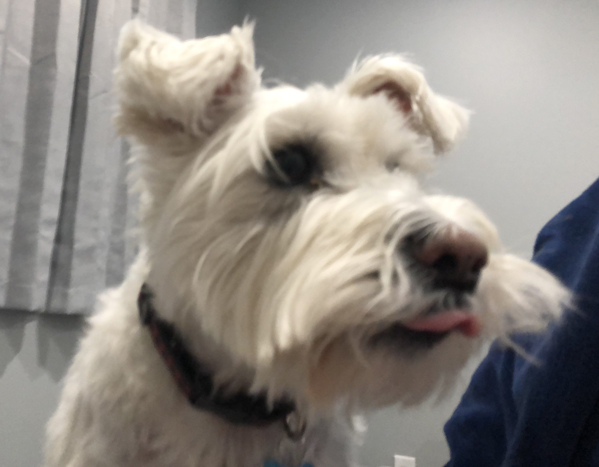

### Hi!
I'm a fourth year computer science student at Queens University! Some of the languages I excel at are: Python, Java, C#, Javascript, GML, Haskell, Prolog, and Pascal. (Thanks CISC 458)

I specialize in AI and have a passion for game development. 

This is <a href="https://lucster10.github.io/resume/Lucas-Patoine-Resume-2024.pdf"  target="_blank">Hello, world!</a> and here's a photo of my dog Stanley!

<!--
**lucster10/lucster10** is a ✨ _special_ ✨ repository because its `README.md` (this file) appears on your GitHub profile.

Here are some ideas to get you started:

- 🔭 I’m currently working on ...
- 🌱 I’m currently learning ...
- 👯 I’m looking to collaborate on ...
- 🤔 I’m looking for help with ...
- 💬 Ask me about ...
- 📫 How to reach me: ...
- 😄 Pronouns: ...
- ⚡ Fun fact: ...
-->
